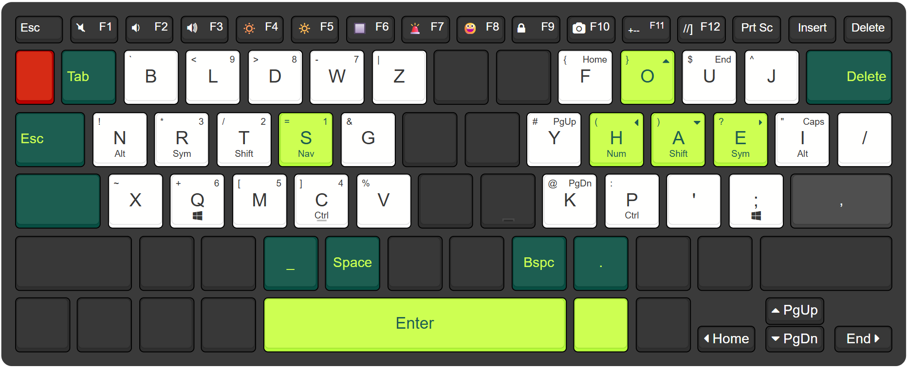

# Pseudo Split Laptop Keyboard

> **Ergonomic columnar-style typing on a standard laptop keyboard.**
---

## Overview

This project explores how far you can push **ergonomic typing** on a *regular laptop keyboard* using only **software remapping**.

By shifting the typing position and rethinking how the spacebar is used, this setup emulates key ideas from high-end **split columnar keyboards** (Corne, Voyager, etc.) including thumb clusters, layers, and home-row modifiers, without the cost or availability issues of dedicated hardware.

>**⚠️NOTE:** I am new to the ergonomic keyboard community, and this layout is very much a **work in progress**. Expect changes, experiments, and refinements over time.

## Motivation & Story

I’m a Computer Science student from Nepal, and I often spend long hours on the keyboard. While I could comfortably reach 100+ WPM on QWERTY, long sessions eventually led to hand discomfort and strain. That pushed me down the ergonomic keyboard rabbit hole.

I dove into the world of ergonomic keyboards and started by switching to **Colemak-DH**. While I enjoyed the stats and the comfort improvement over 3 months, I still felt a hunger to optimize further.

I realized that **Columnar Split Keyboards** (like the Voyager, Corne or custom) are the gold standard for ergonomics. However, there was a barrier:
1.  **Cost:** Most are \$300+ (We use \$2 keyboards in Nepal 😄).
2.  **Availability:** Shipping these niche electronics to Nepal is difficult and expensive.

So instead of buying new hardware, I asked a different question:

*How much of the split-keyboard experience can I recreate on a laptop keyboard using software alone?*

This project is my answer.

## The Concept: The "One-Row-Up" Shift

The biggest limitation of a standard laptop keyboard is the **Spacebar**. On a split ergonomic keyboard, you have "Thumb Clusters", multiple keys accessible by the strongest digit (the thumb). On a laptop, you just have one giant bar.

To solve this, I shifted my typing position:

1.  **The Shift:** I moved the "Home Row" **UP** by one physical row.
    *   *Standard:* Home row is `ASDF`.
    *   *My Layout:* Home row is physically located on the `QWERTY` row.
2.  **The Thumb Cluster:** By moving my hands up, the physical bottom row (standard `ZXCV`) is now positioned perfectly under my thumbs.
    *   This allows me to treat the bottom row keys as a dedicated **Thumb Cluster** without buying new hardware.

## The Layout

My alpha layout is a custom hybrid of **[Graphite](https://github.com/rdavison/graphite-layout)** and **[Gallium](https://github.com/GalileoBlues/Gallium/)**. It is designed to minimize finger travel and maximize comfortable rolls.

### Features
*   **Software:** Powered by [Kanata](https://github.com/jtroo/kanata) for Windows.
*   **Home Row Mods:** I use dual-function keys on the home row (hold for Ctrl/Shift/Alt/Gui, tap for the letter).
*   **Layers:**
    *   Base (Graphite/Gallium Hybrid)
    *   Thumb Keys
    *   Symbol Layer
    *   Number Layer
    *   Navigation Layer
    
    Layers other than the base are highly inspired from the Pascal Getreuer's [keymap](https://github.com/getreuer/qmk-keymap)

### Visualizations
*   View on [Keyboard Layout Editor](https://www.keyboard-layout-editor.com/##@_backcolor=%233a3a3a&name=Pseudo%20split%20laptop%20keyboard&author=Bipul%20Gautam&radii=10px&css=%2F%2F*%0A%2F@import%20url(http%2F:%2F%2F%2F%2Ffonts.googleapis.com%2F%2Fcss%3Ffamily%2F=Varela+Round)%2F%3B%0A%0A.keylabel%20%7B%0A%20%20%20%20font-family%2F:%20'Century%20Gothic'%2F%3B%0A%7D%0A*%2F%2F%0A%0A%2F@import%20url('https%2F:%2F%2F%2F%2Ffonts.cdnfonts.com%2F%2Fcss%2F%2Fcentury-gothic-paneuropean')%2F%3B%0A%0A.keylabel%20%7B%0A%20%20%20%20font-family%2F:%20century-gothic,%20sans-serif%2F%3B%0A%7D%0A%0A%3B&@_c=%232f2f2f&t=%23ffffff&p=CHICKLET&a:6&f:2&w:0.89&h:0.55%3B&=Esc&_a:4&w:0.89&h:0.55%3B&=%0A%3Ci%20class%2F='kb%20kb-Multimedia-Mute-1'%3E%3C%2F%2Fi%3E%0AF1&_w:0.89&h:0.55%3B&=%0A%3Ci%20class%2F='kb%20kb-Multimedia-Volume-Down-2'%3E%3C%2F%2Fi%3E%0AF2&_w:0.89&h:0.55%3B&=%0A%3Ci%20class%2F='kb%20kb-Multimedia-Volume-Up-2'%3E%3C%2F%2Fi%3E%0AF3&_w:0.89&h:0.55%3B&=%0A%F0%9F%94%85%0AF4&_w:0.89&h:0.55%3B&=%0A%F0%9F%94%86%0AF5&_w:0.89&h:0.55%3B&=%0A%F0%9F%94%B2%0AF6&_w:0.89&h:0.55%3B&=%0A%F0%9F%9A%A8%0AF7&_w:0.89&h:0.55%3B&=%0A%F0%9F%98%80%0AF8&_w:0.89&h:0.55%3B&=%0A%3Ci%20class%2F='fa%20fa-lock'%3E%3C%2F%2Fi%3E%0AF9&_w:0.89&h:0.55%3B&=%0A%3Ci%20class%2F='fa%20fa-camera'%3E%3C%2F%2Fi%3E%0AF10&_f2:1&w:0.89&h:0.55%3B&=%0A+--%0AF11&_f:2&w:0.89&h:0.55%3B&=%0A%2F%2F%2F%2F%5D%0AF12&_a:7&w:0.89&h:0.55%3B&=Prt%20Sc&_w:0.89&h:0.55%3B&=Insert&_x:0.009999999999999787&w:0.89&h:0.55%3B&=Delete%3B&@_y:-0.44999999999999996&c=%23bc0000&f:5&w:0.75%3B&=&_c=%23084f43&t=%23b7ff3a&a:6&fa@:3%3B%3B&=Tab&_c=%23ffffff&t=%232f2f2f&a:4&fa@:1%3B%3B&=%60%0A%0A%0A%0A%0A%0A%0A%0A%0AB&_fa@:1&:0&:1%3B%3B&=%3C%0A%0A9%0A%0A%0A%0A%0A%0A%0AL&=%3E%0A%0A8%0A%0A%0A%0A%0A%0A%0AD&=-%0A%0A7%0A%0A%0A%0A%0A%0A%0AW&=%7C%0A%0A%0A%0A%0A%0A%0A%0A%0AZ&_c=%232f2f2f&t=%23ffffff&a:7%3B&=&=&_c=%23ffffff&t=%232f2f2f&a:4%3B&=%7B%0A%0AHome%0A%0A%0A%0A%0A%0A%0AF&_c=%23b7ff3a&t=%23084f43&fa@:1&:0&:2%3B%3B&=%7D%0A%0A%3Ci%20class%2F='fa%20fa-caret-up'%3E%3C%2F%2Fi%3E%0A%0A%0A%0A%0A%0A%0AO&_c=%23ffffff&t=%232f2f2f&fa@:1&:0&:1%3B%3B&=$%0A%0AEnd%0A%0A%0A%0A%0A%0A%0AU&=%5E%0A%0A%0A%0A%0A%0A%0A%0A%0AJ&_c=%23084f43&t=%23b7ff3a&a:6&fa@:1&:0&:3%3B&w:1.5%3B&=%0A%0ADelete%3B&@_f:2&fa@:3%3B&w:1.25%3B&=Esc&_c=%23ffffff&t=%232f2f2f&a:4&f:5&fa@:1&:0&:0&:0&:0&:0&:0&:0&:0&:0&:1%3B%3B&=!%0A%0A%0A%0A%0A%0A%0A%0A%0AN%0AAlt&_fa@:1&:0&:1&:0&:0&:0&:0&:0&:0&:0&:1%3B%3B&=*%0A%0A3%0A%0A%0A%0A%0A%0A%0AR%0ASym&=%2F%2F%0A%0A2%0A%0A%0A%0A%0A%0A%0AT%0AShift&_c=%23b7ff3a&t=%23084f43%3B&=%2F=%0A%0A1%0A%0A%0A%0A%0A%0A%0AS%0ANav&_c=%23ffffff&t=%232f2f2f%3B&=%2F&%0A%0A%0A%0A%0A%0A%0A%0A%0AG&_c=%232f2f2f&t=%23ffffff&a:7%3B&=&=&_c=%23ffffff&t=%232f2f2f&a:4%3B&=%23%0A%0APgUp%0A%0A%0A%0A%0A%0A%0AY&_c=%23b7ff3a&t=%23084f43&fa@:1&:0&:2&:0&:0&:0&:0&:0&:0&:0&:1%3B%3B&=(%0A%0A%3Ci%20class%2F='fa%20fa-caret-left'%3E%3C%2F%2Fi%3E%0A%0A%0A%0A%0A%0A%0AH%0ANum&=)%0A%0A%3Ci%20class%2F='fa%20fa-caret-down'%3E%3C%2F%2Fi%3E%0A%0A%0A%0A%0A%0A%0AA%0AShift&_fa@:1&:0&:1&:0&:0&:0&:0&:0&:0&:0&:1%3B%3B&=%3F%0A%0A%3Ci%20class%2F='fa%20fa-caret-right'%3E%3C%2F%2Fi%3E%0A%0A%0A%0A%0A%0A%0AE%0ASym&_c=%23ffffff&t=%232f2f2f%3B&=%22%0A%0ACaps%0A%0A%0A%0A%0A%0A%0AI%0AAlt&_a:7&f:5%3B&=%2F%2F%3B&@_c=%23084f43&t=%23b7ff3a&f:2&w:1.5%3B&=&_c=%23ffffff&t=%232f2f2f&a:4&f:5&fa@:1%3B%3B&=~%0A%0A%0A%0A%0A%0A%0A%0A%0AX&_fa@:1&:0&:1&:0&:0&:0&:0&:0&:0&:0&:1%3B%3B&=+%0A%0A6%0A%0A%0A%0A%0A%0A%0AQ%0A%3Ci%20class%2F='kb%20kb-logo-windows-8'%3E%3C%2F%2Fi%3E&=%5B%0A%0A5%0A%0A%0A%0A%0A%0A%0AM&_n:true%3B&=%5D%0A%0A4%0A%0A%0A%0A%0A%0A%0AC%0ACtrl&=%25%0A%0A%0A%0A%0A%0A%0A%0A%0AV&_c=%232f2f2f&t=%23ffffff&a:7%3B&=&_n:true%3B&=&_c=%23ffffff&t=%232f2f2f&a:4%3B&=%2F@%0A%0APgDn%0A%0A%0A%0A%0A%0A%0AK&=%2F:%0A%0A%0A%0A%0A%0A%0A%0A%0AP%0ACtrl&_a:7&f:5%3B&='&_a:5&fa@:1&:1%3B%3B&=%0A%3Ci%20class%2F='kb%20kb-logo-windows-8'%3E%3C%2F%2Fi%3E%0A%0A%0A%0A%0A%2F%3B&_c=%23424242&t=%23ffffff&a:7&f:2&fa@:3%3B&w:1.75%3B&=,%3B&@_c=%232f2f2f&w:2%3B&=&_f:5%3B&=&=&_c=%23084f43&t=%23b7ff3a&fa@:3%3B%3B&=%2F_&=Space&_c=%232f2f2f%3B&=&_t=%23ffffff%3B&=&_c=%23084f43&t=%23b7ff3a%3B&=Bspc&=.&_c=%232f2f2f%3B&=&_t=%23ffffff%3B&=&_f:2&w:2.25%3B&=%3B&@=&=&=&=&_c=%23b7ff3a&t=%23084f43&fa@:4%3B&w:5%3B&=Enter&_t=%23ffffff%3B&=&_c=%232f2f2f%3B&=&_x:1.0999999999999996&f:5&fa@:3%3B&w:1.05&h:0.55%3B&=%3Ci%20class%2F='fa%20fa-caret-up'%3E%3C%2F%2Fi%3E%20PgUp%3B&@_y:-0.5499999999999998&x:11&w:1.05&h:0.55%3B&=%3Ci%20class%2F='fa%20fa-caret-left'%3E%3C%2F%2Fi%3E%20Home&_x:0.05000000000000071&w:1.05&h:0.55%3B&=%3Ci%20class%2F='fa%20fa-caret-down'%3E%3C%2F%2Fi%3E%20PgDn&_x:0.05000000000000071&w:1.05&h:0.55%3B&=End%20%3Ci%20class%2F='fa%20fa-caret-right'%3E%3C%2F%2Fi%3E)

## Usage

This setup relies on **Kanata**, a software keyboard remapper that intercepts keyboard input and sends custom events.

1.  **Download Configuration:**
    *   Clone this repository or download the [`kanata.kbd`](/configurations/kanata.kbd) file.

2.  **Run:**
    *   Run Kanata with the configuration.
        see [Kanata's documentation](https://github.com/jtroo/kanata) for more details.

## References & Inspiration

This layout stands on the shoulders of giants in the mechanical keyboard and ergonomic community. Huge thanks to:

*   **[Pascal Getreuer](https://getreuer.info/posts/keyboards/index.html):** For the extensive documentation on keyboards and layouts.
*   **[Ben Vallack](https://www.youtube.com/@BenVallack):** For his videos on layout optimization and minimizing finger travel.
*   **[Graphite Layout](https://github.com/rdavison/graphite-layout)** & **[Gallium Layout](https://github.com/GalileoBlues/Gallium/):** The foundation of my alpha key arrangement.
*   **[Colemak Mod-DH](https://colemakmods.github.io/mod-dh/):** My gateway drug into ergonomic layouts.
*   **[KeymapDB](https://keymapdb.com/):** For layout visualization and inspiration.
*   **[Keyboard Layout Stats](https://cyanophage.github.io/):** For detailed layout analysis.
*   **[r/ErgoMechKeyboards](https://www.reddit.com/r/ErgoMechKeyboards/):** For the endless inspiration.